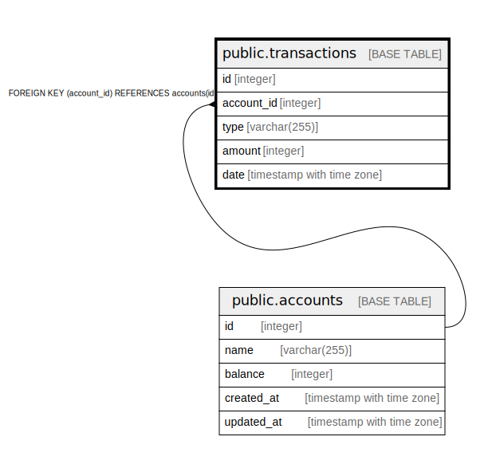

# public.transactions

## Description

## Columns

| Name | Type | Default | Nullable | Children | Parents | Comment |
| ---- | ---- | ------- | -------- | -------- | ------- | ------- |
| id | integer | nextval('transactions_id_seq'::regclass) | false |  |  |  |
| account_id | integer |  | false |  | [public.accounts](public.accounts.md) |  |
| type | varchar(255) |  | false |  |  |  |
| amount | integer |  | false |  |  |  |
| date | timestamp with time zone | CURRENT_TIMESTAMP | true |  |  |  |

## Constraints

| Name | Type | Definition |
| ---- | ---- | ---------- |
| fk_account | FOREIGN KEY | FOREIGN KEY (account_id) REFERENCES accounts(id) |
| transactions_pkey | PRIMARY KEY | PRIMARY KEY (id) |

## Indexes

| Name | Definition |
| ---- | ---------- |
| transactions_pkey | CREATE UNIQUE INDEX transactions_pkey ON public.transactions USING btree (id) |

## Relations

---

> Generated by [tbls](https://github.com/k1LoW/tbls)
